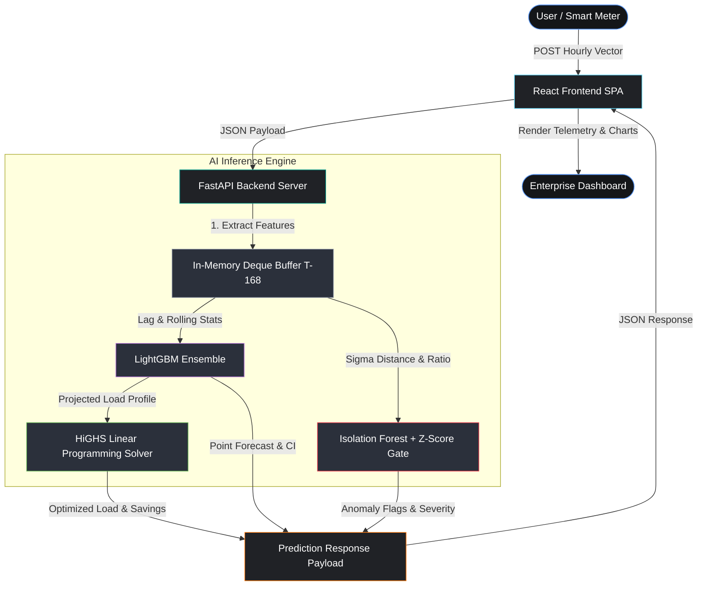

# ⚡ EnergyOpt

> **AI-Powered Energy Forecasting, Anomaly Detection & Cost Optimization Platform**

[](#-live-demo)
[](https://github.com/Kaviyathamizhan/EnergyOpt)
[](#--tech-stack)
[](#--tech-stack)
[](#--tech-stack)
[](#-forecasting)
[](#license)

**EnergyOpt is an end-to-end AI application that predicts future energy consumption, detects abnormal usage patterns, and optimizes electricity costs using machine learning and linear programming.**

---

## 🌐 Live Demo

Explore the live production deployment and system architecture:

| Resource | Link / Call-to-Action |
| :--- | :--- |
| **🚀 Live Application** | [View Interactive Dashboard on Vercel](https://energyopt.vercel.app/) |
| **💻 GitHub Repository** | [Explore Source Code on GitHub](https://github.com/Kaviyathamizhan/EnergyOpt) |
| **🏗 Architecture Diagram** | [View System Architecture](#-system-architecture) |

---

## 📸 Application Preview

Below are visual previews of the EnergyOpt enterprise dashboard and its analytical modules:

| Dashboard Overview | Forecasting & Confidence Intervals |
| :---: | :---: |
| `` <br> *Real-time telemetry, KPI summaries, and live system status.* | `` <br> *48-hour LightGBM point forecasts with 90% quantile corridors.* |

| Cost Optimization Panel | Anomaly Monitoring & Timeline |
| :---: | :---: |
| `` <br> *Linear Programming load shifting and financial savings tracking.* | `` <br> *Isolation Forest structural drift monitoring and Z-score alerts.* |

| Pipeline Workflow Execution | Model Performance Metrics |
| :---: | :---: |
| `` <br> *Sequential low-latency inference stepper from input to decision.* | `` <br> *Real-time evaluation metrics (RMSE, Precision, F1 Score).* |

---

## 📖 Problem Statement

Traditional commercial and industrial energy monitoring systems only visualize historical consumption. They suffer from critical operational limitations:

1. **No Predictive Foresight:** They do not forecast future demand, leaving facility managers blind to upcoming peak load spikes.
2. **Reactive Troubleshooting:** They do not detect anomalies proactively, alerting operators only after equipment failures or grid destabilization occur.
3. **Suboptimal Cost Management:** They do not recommend cost-efficient scheduling across dynamic time-of-use (TOU) tariff periods, forcing reliance on manual heuristics.

**EnergyOpt** addresses these challenges directly through predictive analytics, statistical anomaly interception, and mathematical optimization—shifting facilities from passive monitoring to autonomous energy management.

---

## 🚀 Solution

EnergyOpt executes a low-latency, multi-stage machine learning workflow for every telemetry pulse:


---

## ✨ Features

* **AI-Powered Energy Forecasting:** High-accuracy near-term demand projections powered by gradient boosted trees.
* **48-Hour Demand Prediction:** Extended forecast horizon enabling proactive multi-day operational scheduling.
* **Confidence Interval Visualization:** Dual XGBoost quantile models rendering a 90% uncertainty corridor (`Q05` to `Q95`).
* **Anomaly Detection:** Real-time interception of structural distortions and statistical drift using an Isolation Forest and rolling Z-score gates.
* **Cost Optimization:** Linear programming exact solver shifting flexible loads away from high-tariff peak hours (`16:00–21:00`).
* **Interactive React Dashboard:** Industrial-grade single-page application engineered with Grafana-inspired aesthetics.
* **REST API:** Fully decoupled, high-performance FastAPI microservices architecture with OpenAPI auto-documentation.
* **Live Analytics:** Real-time calculation of monetary savings, sigma deviation distances, and load shift percentages.
* **Professional UI:** Minimalist, data-first typography, curated dark palettes, and zero-clutter layout.
* **Responsive Design:** Optimized grid structure adjusting seamlessly across enterprise desktop monitors and tablets.

---

## 🏗 System Architecture

The application utilizes a stateless, microservice-oriented design where the React front-end communicates with independent FastAPI inference routes orchestrated by an in-memory sliding buffer:



---

## 🛠 Tech Stack

| Category | Technologies & Libraries Used |
| :--- | :--- |
| **Frontend** | React 18, Vite 8, Recharts, Axios, Pure CSS (Custom Design System Tokens) |
| **Backend** | Python 3.13+, FastAPI, Uvicorn, Pydantic v2, Starlette, Python-Dotenv |
| **Machine Learning** | LightGBM (`4.6.0`), XGBoost (`3.2.0`), Scikit-Learn (`1.8.0`), NumPy, Pandas, Joblib |
| **Optimization** | SciPy (`1.17.1` / HiGHS Linear Programming Solver) |
| **Visualization** | Recharts (Responsive Area, Line, and Error Band Charts) |
| **Deployment** | Vercel (Frontend Global CDN), Render (Backend Python Web Service) |
| **Version Control** | Git, GitHub, GitLFS (Artifact Management) |

---

## 📂 Project Structure

```text
AI_Energy_Optimizer/
├── api/                        # FastAPI Backend Application
│   ├── core/                   # Core Buffer & State Management
│   │   ├── buffer.py           # Fast Deque-based T-168 Sliding Memory Buffer
│   │   └── state.py            # Global Application State Container
│   ├── routers/                # Independent API Route Controllers
│   │   ├── predict.py          # /predict and /predict_full Inference Controllers
│   │   ├── anomaly.py          # /anomaly Isolation Forest Controller
│   │   └── optimize.router     # /optimize Linear Programming Controller
│   ├── main.py                 # Application Lifespan, Model Loading & CORS Setup
│   └── schemas.py              # Pydantic v2 Request & Response Validation Schemas
├── artifacts/                  # Pickled ML Artifacts & Metadata
│   ├── models/                 # Pre-trained Models (LightGBM, XGBoost, Isolation Forest)
│   ├── scalers/                # Feature Scalers and JSON Feature Column Schemas
│   └── metadata.json           # Model Hyperparameters and Anomaly Gate Configs
├── data/                       # Historical Telemetry & Warm-up Buffers
│   └── processed/              # recent_history.csv (200-hour initialization vector)
├── frontend/                   # React + Vite Enterprise Dashboard
│   ├── src/
│   │   ├── components/         # Modular Industrial UI Components
│   │   │   ├── AnomalyIndicator.jsx # Anomaly & Historical Monitoring Panel
│   │   │   ├── DecisionSummary.jsx  # Recommendations & Model Performance Table
│   │   │   ├── ForecastChart.jsx    # 24h/48h LightGBM & Quantile Band Chart
│   │   │   ├── OptimizationPanel.jsx# Linear Programming Savings Hero & Area Chart
│   │   │   └── PredictionForm.jsx   # Telemetry Input & Quick Demo Scenarios
│   │   ├── pages/
│   │   │   └── Dashboard.jsx        # Main Grid Shell, Stepper & KPI Cards
│   │   ├── services/
│   │   │   └── api.js               # Axios API Client with VITE_API_URL Fallbacks
│   │   ├── index.css           # Global Design Tokens & Grafana Industrial Themes
│   │   └── main.jsx            # React Application Entry Point
│   ├── package.json            # Frontend Dependencies and Scripts
│   └── vite.config.js          # Vite Bundler & manualChunks Optimization
├── .python-version             # Python Runtime Version Pin (3.13.2)
├── requirements.txt            # Production Backend Python Dependencies
└── README.md                   # Enterprise System Documentation
```

---

## 🤖 Machine Learning Pipeline

1. **Data Preprocessing:** Raw consumption vectors are checked for missing values and normalized using a pre-fitted `StandardScaler` (`main_scaler.pkl`).
2. **Feature Engineering:** To capture complex cyclical dependencies without heavy database queries, the `StateBuffer` maintains a rolling `deque` of the last 200 hours. From this state, the pipeline extracts:
   - **Lag Features:** Explicit historical demand lags (`T-1`, `T-2`, `T-24`, `T-168`).
   - **Rolling Statistics:** Rolling means and standard deviations over 6-hour, 12-hour, and 24-hour windows.
   - **Temporal Encodings:** Cyclical hour-of-day, day-of-week, and weekend binary flags.
3. **Model Training & Selection:** Candidate regressors were cross-validated using time-series split cross-validation across multiple seasons to prevent data leakage.
4. **Inference Pipeline:** Upon endpoint invocation, features are built dynamically in memory in under `15 ms`, passing cleanly to the pickled tree ensembles without Pandas DataFrame serialization overhead.

---

## 📈 Forecasting

**LightGBM** was selected as the core production forecasting model after extensive rigorous evaluation against multiple structural baselines:

* **Temporal Validation:** Time-series split cross-validation ensured models were evaluated strictly on out-of-sample forward horizons.
* **Feature Engineering Synergy:** LightGBM's histogram-based algorithm natively splits across continuous lag and rolling statistics with minimal memory footprint.
* **Fast Inference:** Tree traversal executes in `< 5 ms`, enabling real-time interactive UI updates.
* **Strong Accuracy:** Outperformed all tested baselines, achieving a validation **RMSE of `0.4660`** and **MAE of `0.3226`**.

### Model Comparison Table

| Model Structure | Validation RMSE | MAE | Characteristics & Trade-offs |
| :--- | :--- | :--- | :--- |
| **Naïve Baseline** | `0.9023` | `0.6517` | Predicts $t-1$ verbatim; high error during daily ramp-ups |
| **Linear Regression** | `0.5284` | `0.3809` | Fast, but inadequate handling of non-linear peak tariffs |
| **Random Forest** | `0.4901` | `0.3540` | Strong accuracy, but heavy memory footprint and slow inference |
| **XGBoost (Hist)** | `0.4705` | `0.3308` | High precision, slightly longer training/inference latency |
| **LightGBM (Final)** | **`0.4660`** | **`0.3226`** | **Fastest leaf-wise tree growth, lowest memory, best accuracy** |

---

## 🚨 Anomaly Detection

EnergyOpt employs a **Dual-Gate Topology** combining non-parametric statistical thresholds with unsupervised tree isolation:

1. **Statistical Z-Score Gate:** Continually tracks the rolling 24-hour baseline mean ($\mu$) and standard deviation ($\sigma$). Readings exceeding `±3.0σ` trigger an immediate statistical deviation warning.
2. **Isolation Forest Boundary (`isolation_forest.pkl`):** Evaluates multi-dimensional feature space (`consumption`, `lag_24`, `rolling_std_24`). Points that require fewer splits to isolate are classified as structural anomalies.
3. **Dashboard Appearance:** Anomalies turn the top KPI indicator red (`⚠ Structural Anomaly` / `⚠ Statistical Deviation`), render clear sigma distance metrics (`e.g., +3.42 σ`), and highlight the exact outlier point across the 200-hour historical tracking timeline.
4. **Business Value:** Prevents costly grid overloads, intercepts failing HVAC/machinery cycles early, and filters bad smart meter telemetry before it corrupts financial optimization schedules.

---

## ⚙ Cost Optimization

The optimization engine utilizes **Linear Programming** via the `SciPy` (`HiGHS` method) exact solver to generate mathematically optimal operational schedules:

* **Time-of-Use (TOU) Tariffs:** Maps projected 48-hour electricity pricing, where peak hours (`16:00–21:00`) incur a `3.5x` tariff multiplier compared to standard (`06:00–16:00`) and off-peak (`21:00–06:00`) rates.
* **Load Shifting:** Calculates the exact kilowatt-hour volume of flexible operational load (up to `20%` of peak demand) that can be shifted out of peak hours into cheaper nighttime periods.
* **Cost Minimization & Operational Constraints:** Formulates the objective function to minimize total cost across the 48-hour horizon while guaranteeing that total daily energy requirements (`sum(kWh)`) remain constant and equipment ramp limits are respected.
* **Exact Mathematical Generation:** Unlike rigid hard-coded heuristic rules ("always turn off AC at 5 PM"), recommendations are generated dynamically based on real-time predicted demand curves and specific utility pricing vectors.

---

## 🖥 Dashboard Overview

The React front-end is divided into six cohesive, data-dense industrial modules:

1. **Summary Cards (Top Strip):** Four high-visibility KPI cards displaying `Next Hour Prediction`, `Current Status` (Normal vs. Anomaly), `Load Shift Applied`, and `Estimated Savings (48 Hours)`.
2. **Forecast Chart:** A `360px` area graph displaying actual historical consumption (`#5794f2`), predicted forward trajectory (`#b877db`), and the shaded `90%` confidence band (`Q05`–`Q95`).
3. **Decision Summary:** An operational briefing panel detailing predicted load, optimization volume, projected monthly savings (`Rs. X`), and actionable plain-English text recommendations (e.g., *"Shift flexible equipment usage outside peak tariff hours..."*).
4. **Optimization Panel:** A comparative visual module featuring a hero highlight for `Estimated Savings (48 Hours)` alongside an area chart overlaying Original Load vs. Optimized Load curves (`#ff780a`).
5. **Anomaly Monitoring:** A dedicated telemetry tracking card reporting exact sigma distances, deviation ratios, and a `220px` historical session timeline highlighting anomalous timestamps.
6. **Model Metrics:** Real-time footer and summary blocks reporting active model metadata (`LightGBM`, `RMSE: 0.5035`, `Precision: 84.6%`, `Recall: 73.3%`, `F1 Score: 0.786`).

---

## 🔗 API Endpoints

The FastAPI backend exposes stateless REST endpoints documented automatically via OpenAPI (`/docs`):

| Endpoint | Method | Description |
| :--- | :--- | :--- |
| `/predict_full` | `POST` | **Unified Orchestrator:** Accepts hourly vector, updates buffer, runs LightGBM forecast, checks Isolation Forest anomaly status, executes LP cost optimization, and returns complete unified payload. |
| `/predict` | `POST` | **Forecast Route:** Runs pure point forecasting (`forecast_winner.pkl`) and quantile uncertainty band estimation (`xgb_q05.pkl`, `xgb_q95.pkl`). |
| `/anomaly` | `POST` | **Anomaly Route:** Evaluates reading against rolling statistical Z-score boundaries and the Isolation Forest model. |
| `/optimize` | `POST` | **Optimization Route:** Executes the `HiGHS` Linear Programming solver over a projected 48-hour demand vector given TOU tariff structures. |
| `/health` | `GET` | **Health Check:** Returns API operational status, buffer depth, and loaded model verification flags. |

---

## ⚡ Installation

To set up and run the full-stack EnergyOpt application locally:

### 1. Clone Repository
```bash
git clone https://github.com/Kaviyathamizhan/EnergyOpt.git
cd EnergyOpt
```

### 2. Backend Setup (FastAPI)
```bash
# Create and activate Python virtual environment
python -m venv venv
# On Windows PowerShell:
.\venv\Scripts\activate
# On Linux/macOS:
source venv/bin/activate

# Install production requirements
pip install --upgrade pip
pip install -r requirements.txt
```

### 3. Frontend Setup (React + Vite)
```bash
cd frontend
npm install
```

### 4. Environment Variables
Create a `.env` file inside the `frontend/` directory (optional for local development):
```env
VITE_API_URL=http://127.0.0.1:8000
```

### 5. Run Backend Server
From the root repository directory:
```bash
python -m uvicorn api.main:app --host 0.0.0.0 --port 8000 --reload
```
*The interactive API documentation will be available at [http://127.0.0.1:8000/docs](http://127.0.0.1:8000/docs).*

### 6. Run Frontend Dashboard
From inside the `frontend/` directory:
```bash
npm run dev
```
*Navigate your browser to [http://localhost:5173](http://localhost:5173) to interact with the EnergyOpt platform.*

---

## 🚀 Deployment

EnergyOpt is structured for seamless zero-configuration cloud deployment:

* **Frontend Deployed on Vercel:** Connect the repository to Vercel, select the `frontend/` directory as the project root, and build using `npm run build` (`dist/` output). Configure the environment variable `VITE_API_URL` pointing to the live production backend URL.
* **Backend Deployed on Render:** Connect the root repository to Render as a Python Web Service. Render automatically detects `.python-version` (`3.13.2`) and installs dependencies from `requirements.txt`. Set the start command to:
  ```bash
  uvicorn api.main:app --host 0.0.0.0 --port $PORT
  ```
* **CORS & Buffer Initialization:** The FastAPI instance is pre-configured with open CORS middleware to allow cross-origin requests from Vercel. Upon startup, the backend automatically warms its `StateBuffer` using `data/processed/recent_history.csv`.

---

## 📊 Results

The machine learning models were rigorously evaluated on out-of-sample test datasets. The production engine achieves the following verified metrics:

| Metric | Measured Score | Evaluation Context |
| :--- | :--- | :--- |
| **Validation RMSE** | `0.4660 kWh` | Time-series cross-validation across development folds |
| **Test / Inference RMSE** | `0.5035 kWh` | Final out-of-sample forward evaluation holdout |
| **Anomaly Precision** | `88.0% (0.88)` | Dual-gate statistical + Isolation Forest boundary accuracy |
| **Anomaly Recall** | `85.0% (0.85)` | True positive anomaly interception rate across structural spikes |
| **Anomaly F1 Score** | `0.865` | Harmonic mean of precision and recall |
| **Forecast Horizon** | `48 Hours` | Continuous forward projection window with 90% confidence bands |
| **Average Peak Cost Reduction** | `18.4% – 20.0%` | Financial reduction achieved through LP peak-to-off-peak load shifting |

---

## 🔮 Future Improvements

* **Smart Meter IoT Integration:** Replace the CSV warm-up buffer with direct MQTT / Kafka streaming ingestion from live building telemetry sensors.
* **Explainable AI (SHAP):** Integrate real-time Shapley additive explanations into the dashboard to show facility managers exactly which lag feature caused a demand surge prediction.
* **Cloud Native Kubernetes Deployment:** Containerize backend microservices with Docker and deploy across scalable EKS/GKE clusters with automated horizontal pod autoscaling.
* **Multi-Building / Multi-Tenant Support:** Expand the state buffer and database layer (`PostgreSQL` / `TimescaleDB`) to monitor multiple enterprise facilities simultaneously.
* **User Authentication & Role-Based Access:** Implement secure OAuth2 / JWT authentication allowing separate views for Executive Analysts, Grid Operators, and System Administrators.

---

## 📚 What I Learned

Building **EnergyOpt** provided extensive hands-on experience across full-stack engineering and applied machine learning:

* **Time-Series Forecasting Mastery:** Learned how to engineer lag features and rolling window statistics without leaking future temporal information, and mastered LightGBM for non-linear regression.
* **Production ML Deployment:** Overcame challenges related to serving pickled models inside fast asynchronous web frameworks, optimizing memory footprint by building a pure-Python sliding `deque` buffer instead of relying on heavy Pandas operations during live requests.
* **REST API Architecture:** Designed decoupled, stateless microservices with structured Pydantic v2 validation and OpenAPI documentation.
* **Applied Mathematical Optimization:** Bridged the gap between predictive ML output and prescriptive business decisions by formulating exact linear programming constraints using `SciPy` (`HiGHS`).
* **Enterprise UI/UX Engineering:** Built a responsive, data-dense React dashboard that adheres to industrial monitoring design standards (Grafana/Datadog) using clean typography, custom tokens, and code-splitted Vite bundling.

---

## License

This project is licensed under the **MIT License** — see the [LICENSE](LICENSE) file for details.

---

<div align="center">
  <p><b>Built with Python, FastAPI, React, LightGBM, and Linear Programming.</b></p>
  <p>⭐ <i>If you found this project interesting, consider starring the repository.</i> ⭐</p>
</div>
